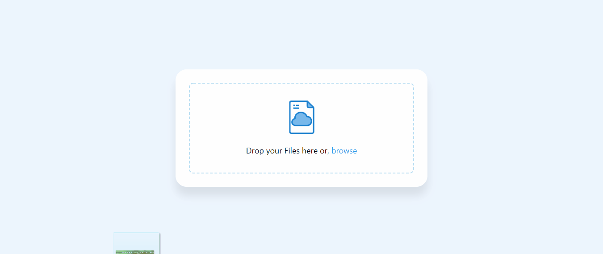

# node-fileshare

### Learning Resource
### Javascript Drag events

<a href="https://developer.mozilla.org/en-US/docs/Web/API/HTML_Drag_and_Drop_API">https://developer.mozilla.org/en-US/docs/Web/API/HTML_Drag_and_Drop_API</a>

### Xhr Spload Status

<a href="https://developer.mozilla.org/en-US/docs/Web/API/XMLHttpRequest/upload">https://developer.mozilla.org/en-US/docs/Web/API/XMLHttpRequest/upload</a>

## DEMO <a href="https://fileshare123.herokuapp.com/">Node.js express multer file share Web</a>
